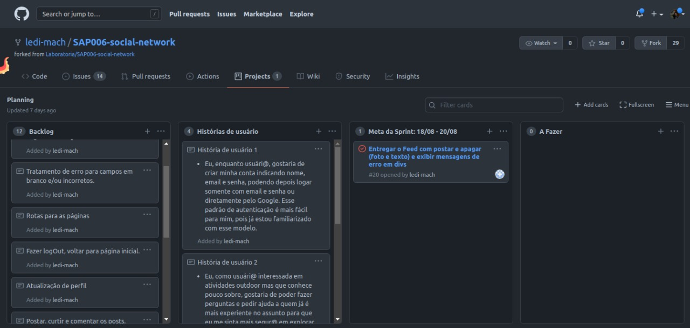
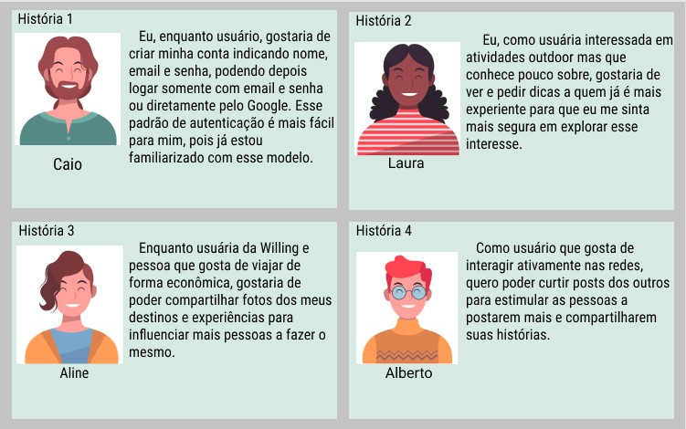
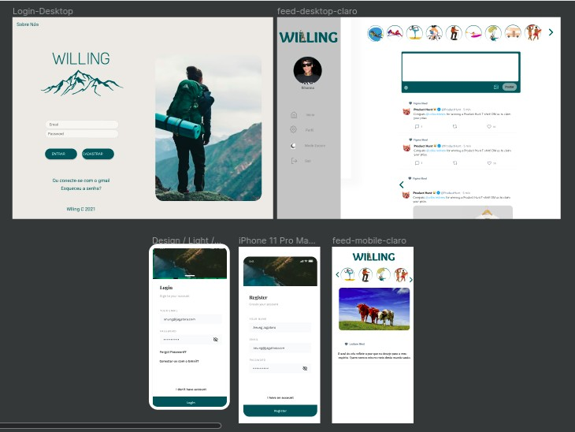

# Willing
## Introdução 
Instagram, Snapchat, Twitter, Facebook, Twitch, Linkedin, etc. As redes sociais invadiram nossas vidas. Nós as amamos ou odiamos, e muitas pessoas não conseguem viver sem elas. 
Há redes sociais de todo tipo para todos os tipos de interesse e ali podemos interagir com pessoas que tenham interesses e valores semelhantes aos nossos ao mesmo tempo que conhecemos 
outras opiniões e visões de mundo.
Recebemos da Laboratoria o desafio de criar uma rede social que abordasse um tema relevante para nós e por isso criamos a Willing.

## Apresentação
A Willing é uma rede social voltada para entretenimento e troca de experiências entre entusiastas de atividades outdoor, desde atividades mais básicas como caminhadas até viagens compartilhadas e/ou mochilões.
Você pode conferir ela clicando [aqui](https://rede-social-ab0d1.web.app/).

## Planejamento e desenvolvimento
O planejamento do projeto foi feito no GitHub categorizando e direcionando com as issues e desenvolvendo usando o método kanban.Definimos o backlog partindo de conversação e das necessidades previstas após a prototipagem no figma e definição das histórias de usuário. O planejamento sofreu algumas variações no decorrer do processo, mas uma versão dele pode ser vista abaixo.

## Histórias de usuário
Com base nas pesquisas e no levantamento das informações obtidas, desenvolvemos quatro histórias de usuário para guiar o desenvolvimento do projeto:

### Soluções de pronto e critérios de aceitação:
História 1: A página inicial deverá ter botões que intuitivamente orientem o usuário para logar com email e senha, 
cadastrar novo usuário  e login pelo Google.
Quando o usuário selecionar “cadastrar”, deverá ser direcionado à uma página onde indicará nome, email e senha. 
O clique em “entrar” irá direcionar para a página de feed se os campos email e senha estiverem preenchidos corretamente, caso contrário apresentará uma mensagem de erro. 
Da mesma forma será direcionado à página de feed se o login com google tiver sucesso ou apresentando o erro caso não logue.

História 2: A página de feed terá local para compartilhar textos, tanto na forma de posts como de comentários. O usuário deverá ser capaz de poder fazer posts e comentar no post feito por outras pessoas, bem como deletar possíveis posts e comentários.

História 3: Nos posts, os usuários também deverão conseguir postar imagens, tanto acompanhadas de texto quanto sem.

História 4: Os usuários devem poder curtir os posts de outros usuários e poder fazê-lo uma única vez.

## Protótipo

## Linguagens e ferramentas utilizadas
- *HTML5 e CSS*: HTML semântico, flexbox.
- *DOM e Web APIs*: Manipulação do DOM, History API, localStorage.
- *JavaScript*: Uso de callbacks, consumo de promises, ES modules (import | export).
- *Firebase*: Firestore, Firebase Auth, Firebase Security Rules, Uso de OnSnapshot | OnAuthStateChanged.
- *Testing*: Testes unitários, testes assíncronos, mocking.
- *GIT e GitHub*: Colaboração e organização pelo GitHub, uso de comandos.

## Autoria
Projeto desenvolvido por [Laís](https://www.linkedin.com/in/la%C3%ADs-ayume-lima-mune/), [Julli](https://www.linkedin.com/in/julli-mayanne-/) e [Lediane](https://www.linkedin.com/in/ledianemachado/).
